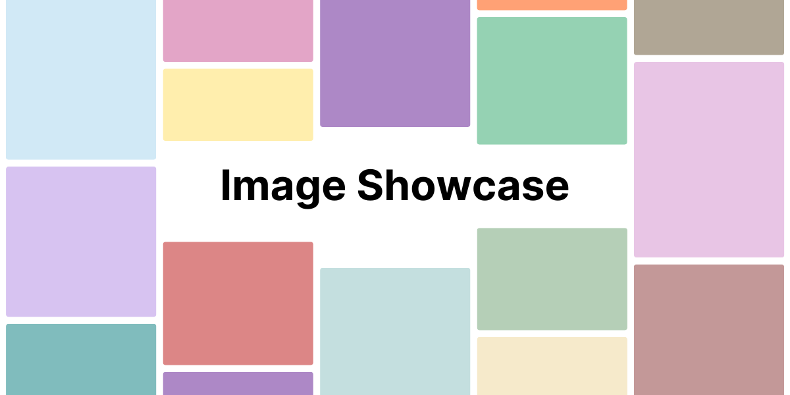

[](https://github.com/ythepaut/image-showcase/blob/master/LICENSE)
[](https://github.com/ythepaut/image-showcase/actions)
[](https://sonarcloud.io/project/overview?id=ythepaut_image-showcase)
[](https://sonarcloud.io/project/overview?id=ythepaut_image-showcase)
[](https://showcase.ythepaut.com/)

:warning: **Work in progress** :warning:

## Features

- [x] Image gallery (masonry layout)
- [x] Image zooming
- [x] Image EXIF data
- [ ] Multiple galleries
- [ ] Gallery management

## Installation

1. Installation\
Choose one of the following methods:

    a. Vercel deployment\
    [](https://vercel.com/new/ythepauts-projects/clone?repository-url=https%3A%2F%2Fgithub.com%2Fythepaut%2Fshowcase&env=ENVIRONMENT,APP_NAME,APP_DESCRIPTION,APP_KEYWORDS,APP_URL,IMAGES_URL,TIMEZONE,DEFAULT_LOCALE)

    b. Manual installation
    - Clone this repository
    - Build the project using `npm run build`
    - The app can be started using `npm start`

2. Setup the image list *(temporary)*\
   Create a JSON file that contains your images in this format :
   ```json
   {
     "id": "1",
     "src": "https://placehold.co/800x600/png?text=1",
     "width": 800,
     "height": 600,
     "title": "Image 1"
   }
   ```
   :arrow_right: [File example](https://raw.githubusercontent.com/ythepaut/image-showcase/3ac2355f26ffafab5d2c4d2110d1af269ced9e58/public/assets/images.json)

3. Set the following environment variables
    ```bash
    ENVIRONMENT=production

    # Open Graph Metadata
    # Application name (e.g. Image Showcase)
    APP_NAME=
    # Website description (e.g. My Image Gallery)
    APP_DESCRIPTION=
    # Comma separated website key words (e.g. gallery, myname, showcase)
    APP_KEYWORDS=
    # Application production url
    APP_URL=
    
    # URL to the image list (c.f. 2.)
    IMAGES_URL=
    
    # Your timezone and default locale (only fr and en are supported)
    TIMEZONE=Europe/Paris
    DEFAULT_LOCALE=fr
    ```


## About

### Built with

- [Next.js](https://nextjs.org/)
- [Tailwind CSS](https://tailwindcss.com/)

### License

GNU GPL v3.0 License

See [LICENSE](https://github.com/occult-app/crypto/blob/master/LICENSE) file.
